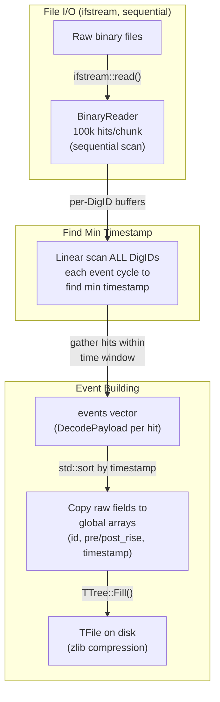
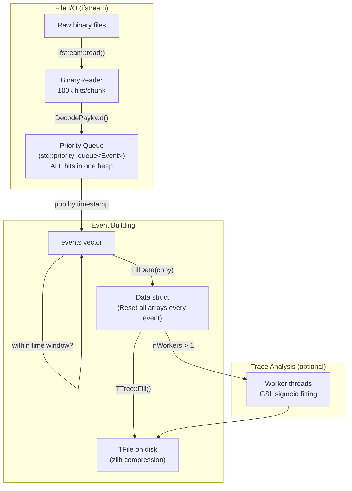
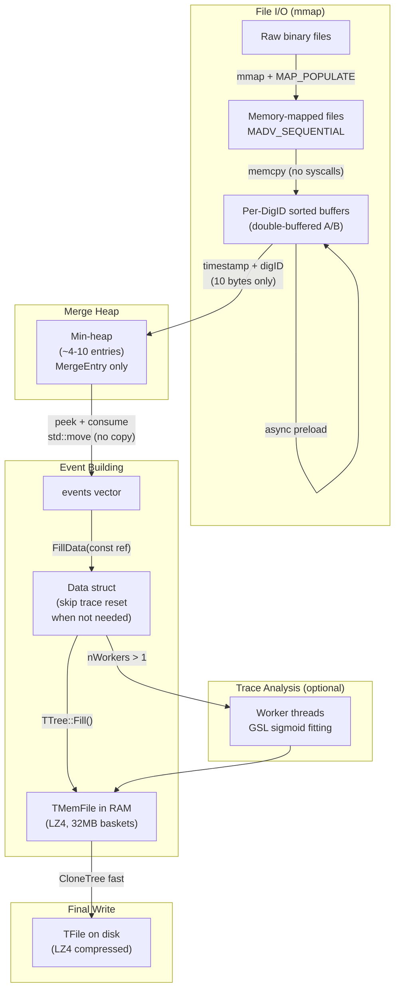
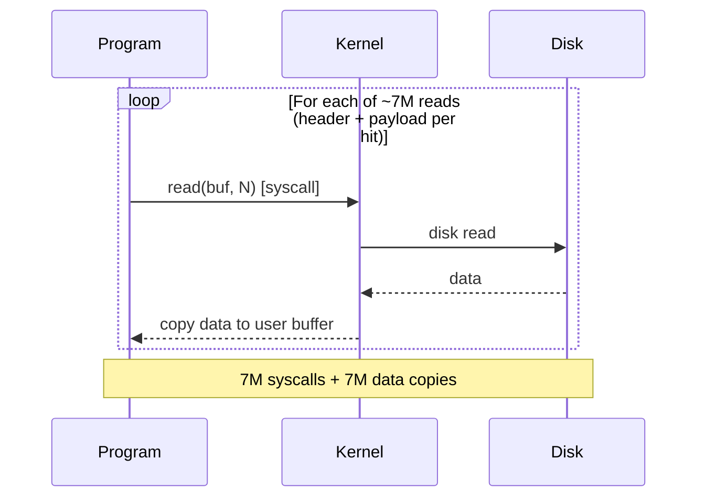
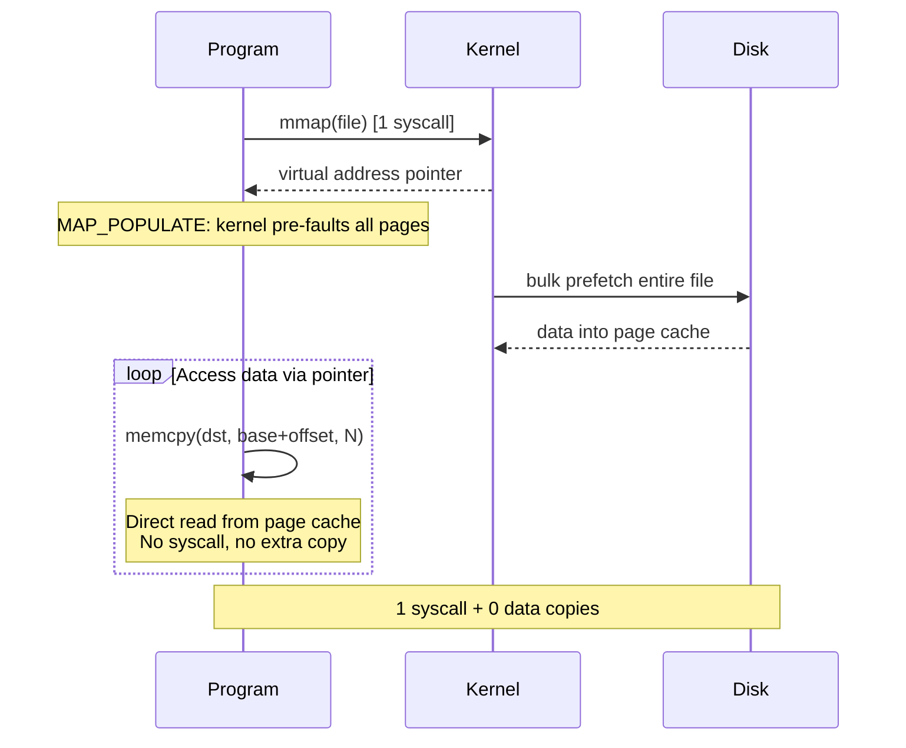

# EventBuilder Optimization Notes

**Created:** 2026-04-18  
**Author:** Ryan Tang + Master HELIOS  
**Test data:** h096 run011 (10 files, 2.3 GB, 3,508,889 hits)  
**Platform:** Spark (Cortex-X925 @ 3.9 GHz, 122 GB RAM, NVMe)

---

## EventBuilder Versions

| Version | File | Description |
|---------|------|-------------|
| `EventBuilder` | `EventBuilder.cpp` | Original — raw hit output, linear min-scan, no detector mapping |
| `EventBuilder_Q` | `EventBuilder_Q.cpp` | With mapping (Q) |
| `EventBuilder_S` | `EventBuilder_S.cpp` | "Super" — detector mapping, priority queue, multi-threaded trace analysis |
| `EventBuilder_A` | `EventBuilder_A.cpp` | "Advanced" — all _S features + I/O and build optimizations |

All builders live in `~/digios/analysis/EventBuilder/`.

---

## Data Flow Overview

### EventBuilder (Original)

**Key characteristics:**
- **No detector mapping** -- output is raw hit data (board*10+channel, pre/post rise energy, timestamp)
- **No priority queue** -- finds minimum timestamp by scanning all DigID buffers linearly each event
- **No trace analysis** -- saves raw traces only (no GSL fitting)
- Fewer TTree branches = faster Fill (no Energy/XF/XN/Ring/RDT arrays)
- Simple but effective for small numbers of DigIDs (~4-10)
- Output tree name: `tree` (not `gen_tree`)

### EventBuilder_S ("Super")

**Key characteristics of _S:**
- All hits from all files pushed into one large `std::priority_queue<Event>`
- Each push/pop copies the full Event (including payload vector)
- File reads via `ifstream::read()` — one syscall per header + payload
- TTree writes directly to disk TFile with zlib compression
- `Data::Reset()` zeroes all arrays including trace[60][1250] every event

### EventBuilder_A (Optimized)

**Key characteristics of _A:**
- mmap'd file I/O with `MAP_POPULATE` + `MADV_SEQUENTIAL` — no per-read syscalls
- Per-DigID sorted buffers with async double-buffering (read next chunk while processing)
- Lightweight merge heap: only stores `{timestamp, digID}`, not full Events
- Events moved (not copied) from sorted buffers via `std::move`
- `FillData()` takes `const std::vector<Event>&` (no vector copy)
- `Data::Reset(bool resetTrace)` — skips 75k-element trace array zeroing when no trace
- TTree fills into `TMemFile` (RAM) with LZ4 compression + 32 MB basket size
- Single fast `CloneTree` copy to disk at the end

---

## Optimizations Applied (chronological)

### 1. Sort-then-merge architecture (_A base design)
- Replace global `priority_queue<Event>` with per-DigID sorted buffers + lightweight merge heap
- Merge heap holds ~4-10 `MergeEntry` (10 bytes) instead of millions of Events
- Events stay in-place in sorted buffers, moved out via `std::move`

### 2. Async double-buffered I/O (_A base design)
- Each DigID has two buffers (A/B): one being consumed, one being pre-read async
- `std::async` preloads next chunk while main thread builds events from current chunk
- Hides most read latency behind event processing

### 3. TMemFile + LZ4 + large baskets
- TTree fills go to `TMemFile` (RAM) instead of disk TFile
- LZ4 compression (4× faster than zlib, ~37% larger file — 88 MB vs 64 MB)
- 32 MB basket size (vs 32 KB default) — reduces basket flush overhead
- `SetAutoFlush(0)` — no mid-run flushes
- **Impact:** TTree::Fill time cut from 3.6s → 1.5s

### 4. Optimized `Data::Reset(bool resetTrace)`
- Skip zeroing `trace[60][1250]` (75k elements) when no trace analysis
- Use `memset` for timestamp arrays, `_fillNaN()` helper for float arrays
- **Impact:** Reset time reduced (negligible in final timing, but was part of the cumulative gain)

### 5. `FillData()` by const reference
- Changed from `void FillData(std::vector<Event> events, ...)` (copy)
  to `void FillData(const std::vector<Event>& events, ...)` (reference)
- Eliminates vector copy per event (1.87M events)

### 6. Removed redundant inner sort
- Events from merge heap are already in timestamp order
- Removed `std::sort(events.begin(), events.end(), ...)` in build loop
- **Impact:** ~0 (events average 1.87 hits, sort on 1-2 elements is free)

### 7. mmap file I/O
- Files opened with `mmap()` + `MAP_POPULATE` (kernel prefetches entire file)
- `madvise(MADV_SEQUENTIAL)` hints for sequential access
- `ReadNextNHitsFromFile` uses `memcpy` from mapped memory instead of `ifstream::read()`
- Falls back to ifstream if mmap fails
- **Impact:** Read time 1.37s → 0.47s (2.9× faster)

#### What is mmap?

`mmap` (memory-mapped file I/O) maps a file directly into the process's virtual address space.
Instead of reading the file with syscalls, you access it like an array in memory.

**Normal file I/O (ifstream):**

**mmap:**

**Comparison:**

| | ifstream | mmap |
|---|---|---|
| Syscalls | ~7M (per read) | 1 (setup) |
| Data copies | kernel → user buffer each time | zero (read from page cache) |
| Memory | separate read buffer | file IS the buffer |
| Prefetch | manual / OS guessing | explicit (`MADV_SEQUENTIAL`) |
| Fallback | always works | needs local filesystem |

**Key flags:**
- `MAP_POPULATE` — pre-fault all pages at mmap time (load entire file upfront)
- `MAP_PRIVATE` — copy-on-write (safe, read-only access)
- `MADV_SEQUENTIAL` — tell kernel we read front-to-back (optimize readahead)

**RAM safety:** mmap does NOT require the full file to fit in RAM. Pages are loaded on demand
and can be evicted under memory pressure (they're file-backed, not anonymous). Works on
machines with limited RAM, just without the prefetch benefit.

---

## _A Base Architecture Improvements over _S

Before any of the optimization passes above, _A's base design already improved on _S:

| Feature | _S | _A |
|---------|----|----|    
| **Merge strategy** | `priority_queue<Event>` with ALL hits | Lightweight `priority_queue<MergeEntry>` (~10 entries, 10 bytes each) |
| **Event data** | Copied in/out of priority queue | Stays in sorted buffers, moved via `std::move` |
| **Sort approach** | O(N log N) heap operations on full Events | Per-chunk `std::sort` + O(N log k) k-way merge (k ≈ 4-10) |
| **I/O pattern** | Read → process → read (serial) | Async double-buffer: read next chunk while processing current |
| **TTree output** | Direct to disk TFile | TMemFile (RAM), single copy to disk at end |
| **File scanning** | Sequential | Parallel threads |

---

## Benchmark Results

### h096 run011, timeWindow=100, no trace analysis

| Version | Read | TTree::Fill | Total | vs _S |
|---------|------|-------------|-------|-------|
| **Original** | — | — | **4.779 s** | 1.74× faster* |
| **_S baseline** | ~2.0s (est.) | ~5.5s (est.) | **8.324 s** | 1.0× |
| _A (base) | 1.28 s | 3.6 s | 6.578 s | 1.27× |
| + Reset/FillData opt | 1.37 s | 3.6 s | 5.169 s | 1.61× |
| + LZ4 + 32MB baskets | 1.38 s | 1.5 s | 3.200 s | 2.60× |
| + mmap | 0.47 s | 1.5 s | 2.989 s | 2.78× |
| **_A Final (clean)** | **0.47 s** | **~1.5 s** | **2.824 s** | **2.95×** |

\* Original is faster than _S because it has far fewer TTree branches (raw hit data only,
no detector mapping arrays) and uses simple linear scan instead of priority queue.
_S/_A do more work: detector mapping, Energy/XF/XN/Ring/RDT arrays, trace analysis support.

### Other configurations

| Config | Original | _S | _A final | _A vs _S |
|--------|----------|-----|----------|----------|
| tw=100k, no trace | 4.447 s | 7.016 s | ~2.5 s (est.) | ~2.8× |
| tw=100, no trace | 4.779 s | 8.324 s | 2.824 s | 2.95× |
| tw=100, trace analysis (1-core) | N/A | 11.750 s | ~9.5 s (est.) | ~1.2× |

### Timing breakdown (_A final, tw=100 no trace)

| Phase | Time | % |
|-------|------|---|
| Scan (parallel, ifstream) | 0.80 s | 28% |
| Read (mmap) | 0.47 s | 17% |
| Decode (ntohl) | 0.20 s | 7% |
| Sort (per-chunk) | 0.09 s | 3% |
| Heap + events | 0.14 s | 5% |
| Reset + FillData | 0.14 s | 5% |
| **TTree::Fill** | **1.50 s** | **53%** |
| RAM→Disk copy | 0.29 s | 10% |

**Remaining bottleneck:** `TTree::Fill()` at ~0.8 µs/call (1.87M calls). This is ROOT serialization overhead — ~3,100 CPU cycles per Fill at 3.9 GHz. Further improvement would require reducing branch count, batched serialization, or a different output format.

---

## Output Compatibility

- Output `.root` file uses **LZ4 compression** (instead of zlib)
- Fully compatible with ROOT — readable by TBrowser, hadd, all analysis macros
- File size ~37% larger than zlib (88 MB vs 64 MB for this run)
- All analysis scripts (GeneralSort, etc.) work unchanged

---

## Key Time Window Insight

The time window affects the number of output events, not the number of input hits:

| Time Window | Hits (fixed) | Events | Avg hits/event |
|-------------|-------------|--------|----------------|
| 100 ticks | 3,508,889 | 1,876,086 | 1.87 |
| 100,000 ticks | 3,508,889 | 1,342,207 | 2.61 |

Larger time window = more hits merged per event = fewer, larger events.

---

## Files Modified

- `EventBuilder_A.cpp` — all optimizations above
- `BinaryReader.h` — mmap support (with ifstream fallback)
- `Hit.h` — unchanged
- `makefile` — unchanged

---

## Data Structures (Hit.h / Event class)

**Source:** `EventBuilder/Hit.h` (287 lines)

### GEBHeader
Global Event Buffer header (16 bytes):
- `type` (uint32) -- payload type identifier
- `payload_length_byte` (uint32) -- payload size in bytes
- `timestamp` (uint64) -- event timestamp

### Event class
Decoded digitizer hit. Key fields:

| Field | Type | Description |
|---|---|---|
| `channel` | unsigned | Channel ID (0-9 per board) |
| `board` | unsigned | Board ID |
| `timestamp` | uint64 | Timestamp in 10 ns ticks |
| `pre_rise_energy` | uint32 | Energy before rise (baseline) |
| `post_rise_energy` | uint32 | Energy after rise (signal) -- primary energy |
| `traceLength` | uint16 | Number of trace samples |
| `trace` | vector<uint16> | Raw ADC trace waveform |
| `flags` | uint16 | Bit flags: ext disc(0), peak valid(1), offset(2), sync err(3), gen err(4), pileup(5/6) |
| `baseline` | uint32 | Baseline value |
| `m1/m2_begin/end_sample` | uint16 | Integration window markers |
| `peak_sample` | uint16 | Sample index of peak |
| `cfd_sample_0/1/2` | uint16 | CFD timing samples |

**Key:** `post_rise_energy - pre_rise_energy` = net pulse energy (what becomes `e[]` in gen_tree).

### Hit class (wrapper)
Stores `GEBHeader` + raw payload bytes. `Decode()` method parses payload into `Event`.

### id convention
`id = board_id * 10 + channel_id` -- matches `GeneralSortMapping.h` channel numbering.

_Hit.h data structures documented: 2026-04-29._
