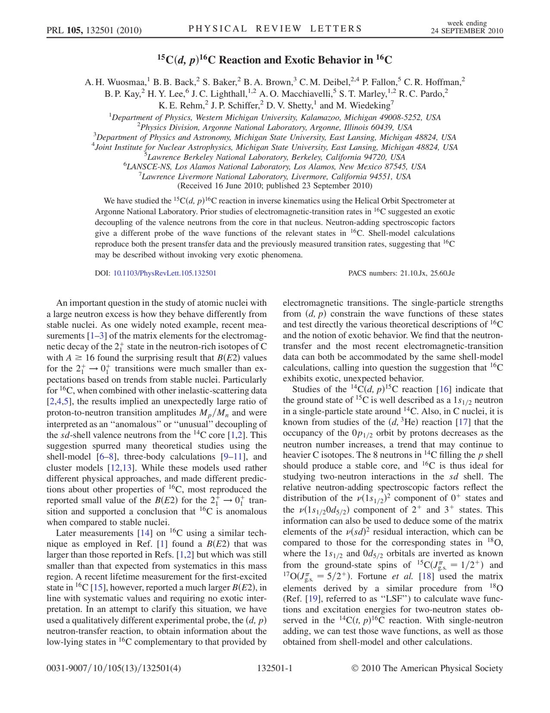
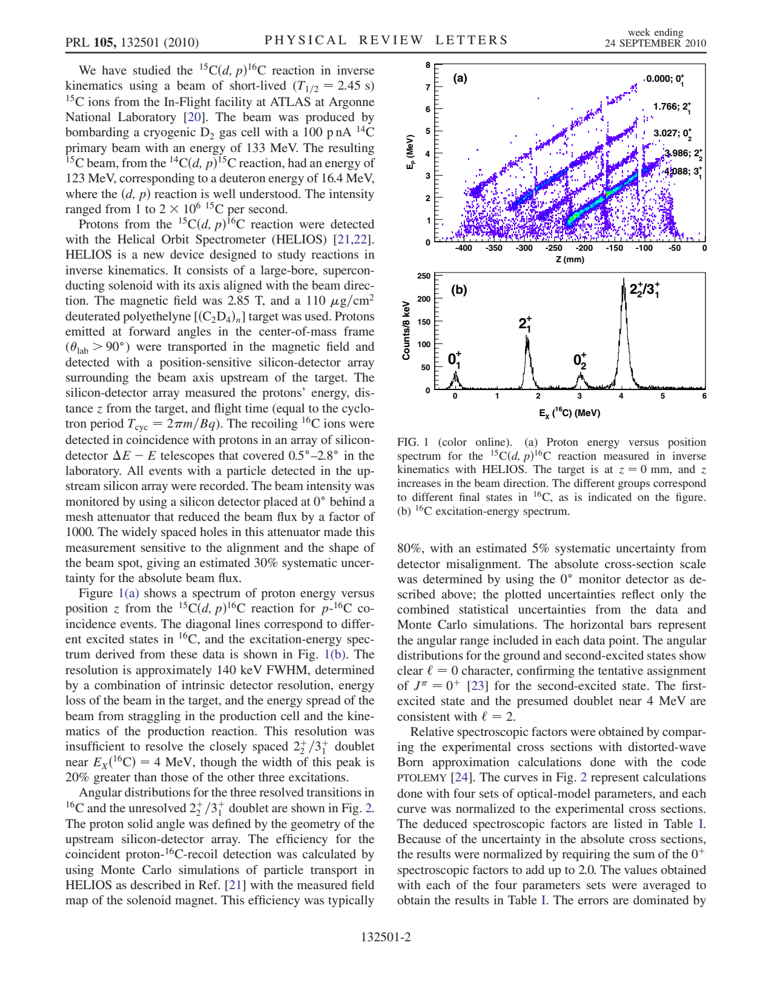
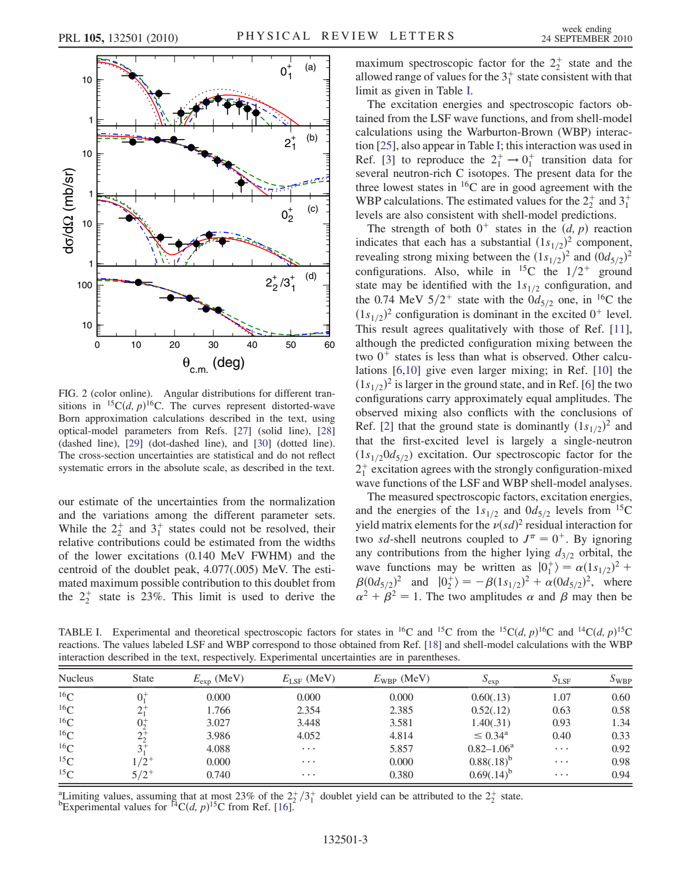
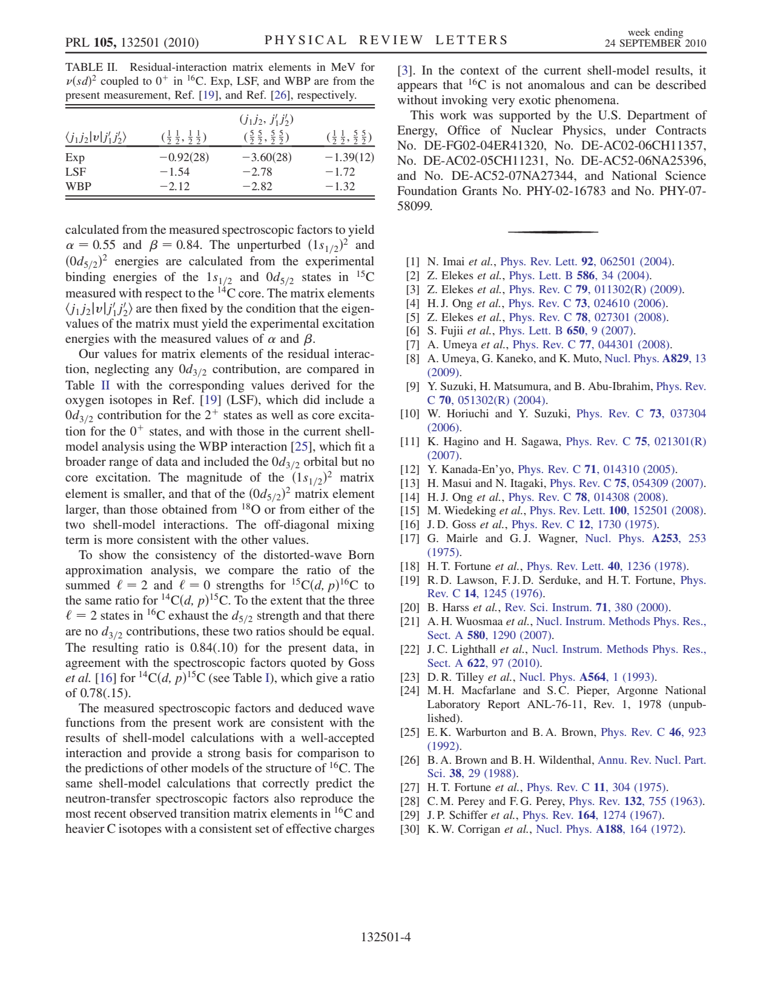

# 2010 Wuosmaa 15Cdp16C

**Source:** `/home/heliosspark/publications/2010_Wuosmaa_15Cdp16C.pdf`  
**Pages:** 4  
**Extracted:** pages [1, 2, 3, 4]  
**DPI:** 150  

---

## Pages

### Page 1

*15C(d,p) 16C Reaction and Exotic Behavior in 16C A. H. Wuosmaa,1 B. B. Back,2 S. Baker,2 B. A. Brown,3 C. M. Deibel,2,4 P. Fallon,5 C. R. Hoffman,2 B. P. Kay,2 H. Y. Lee,6 J. C. Lighthall,1,2 A. O. Ma...*

### Page 2

*We have studied the 15C(d,p) 16C reaction in inverse kinematics using a beam of short-lived (T1=2 ¼ 2:45 s) 15C ions from the In-Flight facility at ATLAS at Argonne National Laboratory [20]. The beam...*

### Page 3

*our estimate of the uncertainties from the normalization and the variations among the different parameter sets. While the 2þ 2 and 3þ 1 states could not be resolved, their relative contributions could...*

### Page 4

*calculated from the measured spectroscopic factors to yield  ¼ 0:55 and  ¼ 0:84. The unperturbed ð1s1=2Þ 2 and ð0d5=2Þ 2 energies are calculated from the experimental binding energies of the 1s1=2 a...*

---

## Full Text

See [text.md](text.md) for the complete extracted text.