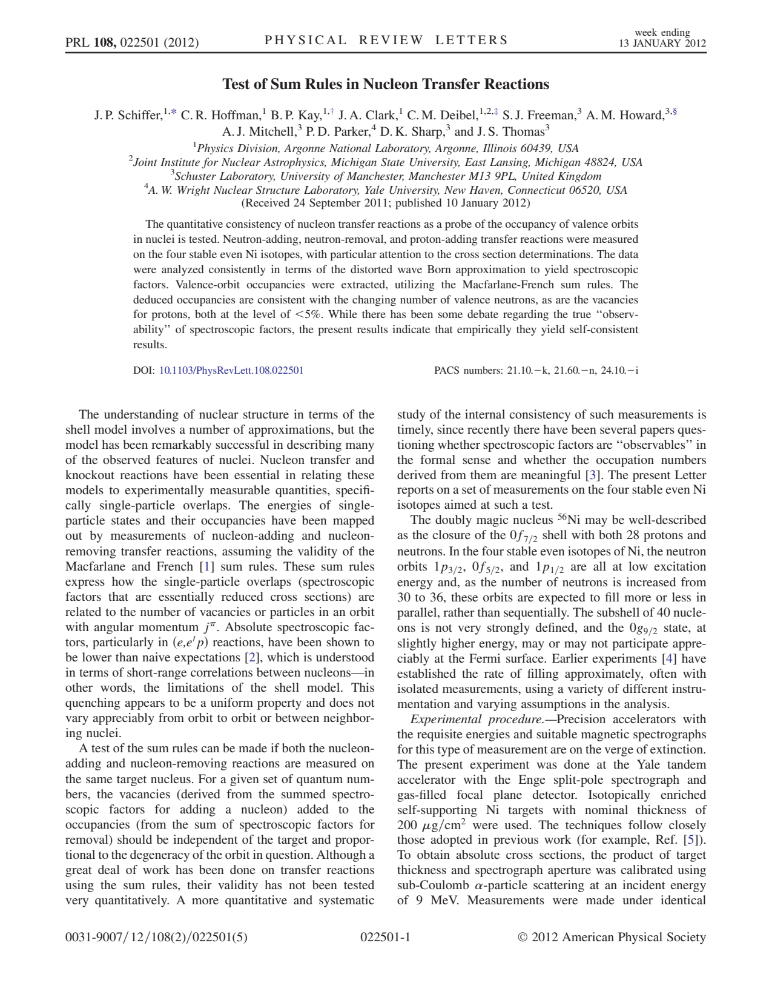
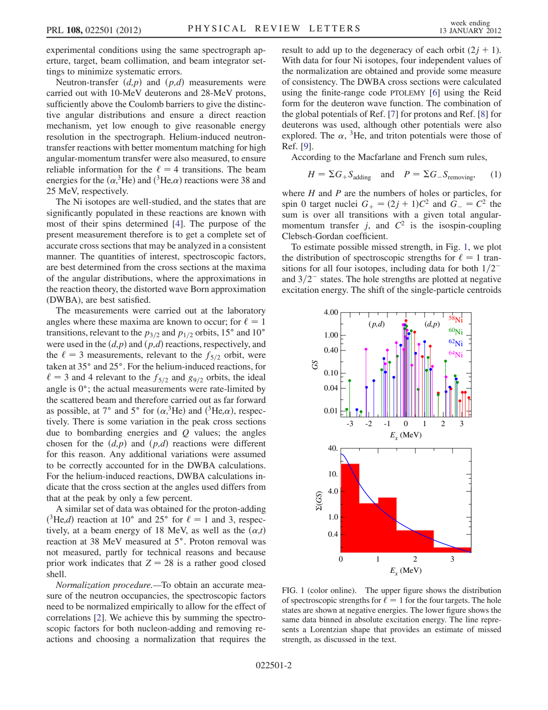
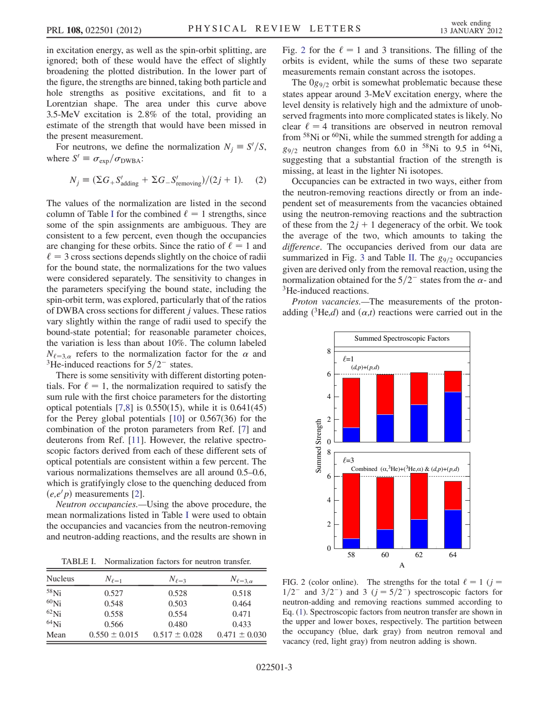
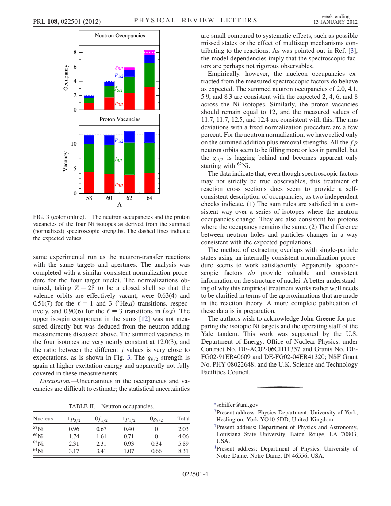
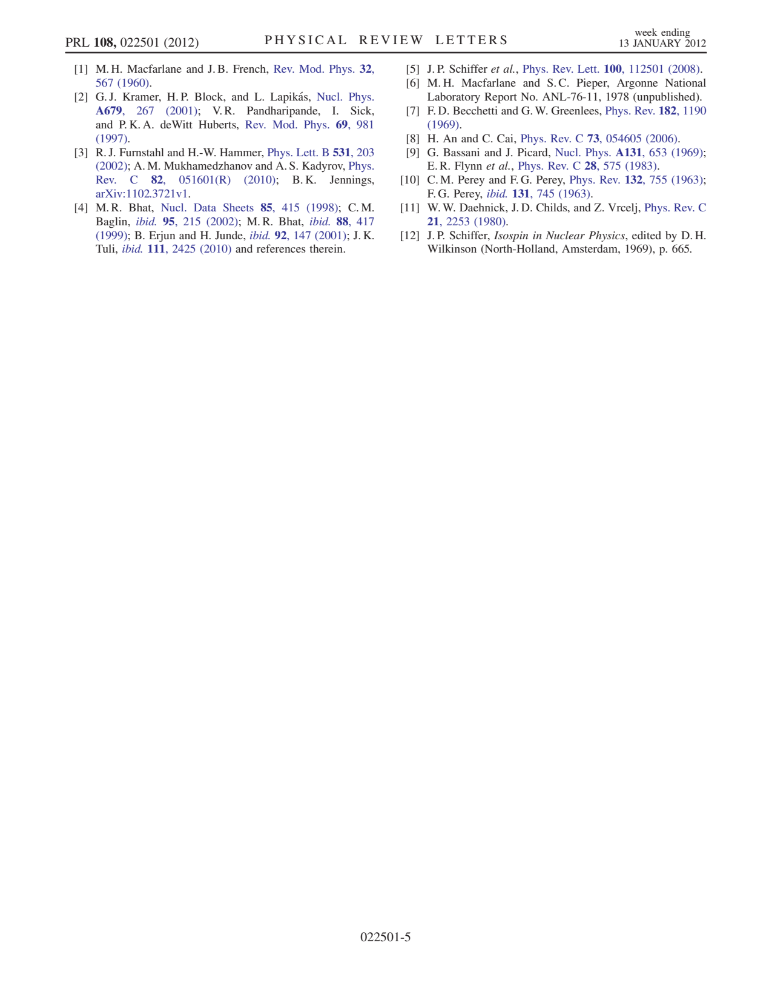

# 2012 Schiffer NiSumRules

**Source:** `/home/heliosspark/publications/2012_Schiffer_NiSumRules.pdf`  
**Pages:** 5  
**Extracted:** pages [1, 2, 3, 4, 5]  
**DPI:** 150  

---

## Pages

### Page 1

*Test of Sum Rules in Nucleon Transfer Reactions J. P. Schiffer,1,* C. R. Hoffman,1 B. P. Kay,1,† J. A. Clark,1 C. M. Deibel,1,2,‡ S. J. Freeman,3 A. M. Howard,3,§ A. J. Mitchell,3 P. D. Parker,4 D. K....*

### Page 2

*experimental conditions using the same spectrograph ap￾erture, target, beam collimation, and beam integrator set￾tings to minimize systematic errors. Neutron-transfer ðd;pÞ and ðp;dÞ measurements were...*

### Page 3

*in excitation energy, as well as the spin-orbit splitting, are ignored; both of these would have the effect of slightly broadening the plotted distribution. In the lower part of the figure, the streng...*

### Page 4

*same experimental run as the neutron-transfer reactions with the same targets and apertures. The analysis was completed with a similar consistent normalization proce￾dure for the four target nuclei. T...*

### Page 5

*[1] M. H. Macfarlane and J. B. French, Rev. Mod. Phys. 32, 567 (1960). [2] G. J. Kramer, H. P. Block, and L. Lapika´s, Nucl. Phys. A679, 267 (2001); V. R. Pandharipande, I. Sick, and P. K. A. deWitt H...*

---

## Full Text

See [text.md](text.md) for the complete extracted text.